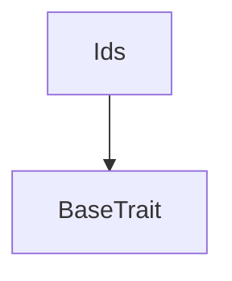
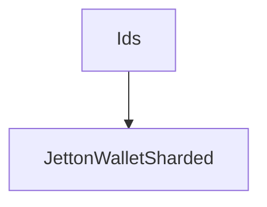

# Tact compilation report
Contract: Ids
BoC Size: 39899 bytes

## Structures (Structs and Messages)
Total structures: 78

### DataSize
TL-B: `_ cells:int257 bits:int257 refs:int257 = DataSize`
Signature: `DataSize{cells:int257,bits:int257,refs:int257}`

### SignedBundle
TL-B: `_ signature:fixed_bytes64 signedData:remainder<slice> = SignedBundle`
Signature: `SignedBundle{signature:fixed_bytes64,signedData:remainder<slice>}`

### StateInit
TL-B: `_ code:^cell data:^cell = StateInit`
Signature: `StateInit{code:^cell,data:^cell}`

### Context
TL-B: `_ bounceable:bool sender:address value:int257 raw:^slice = Context`
Signature: `Context{bounceable:bool,sender:address,value:int257,raw:^slice}`

### SendParameters
TL-B: `_ mode:int257 body:Maybe ^cell code:Maybe ^cell data:Maybe ^cell value:int257 to:address bounce:bool = SendParameters`
Signature: `SendParameters{mode:int257,body:Maybe ^cell,code:Maybe ^cell,data:Maybe ^cell,value:int257,to:address,bounce:bool}`

### MessageParameters
TL-B: `_ mode:int257 body:Maybe ^cell value:int257 to:address bounce:bool = MessageParameters`
Signature: `MessageParameters{mode:int257,body:Maybe ^cell,value:int257,to:address,bounce:bool}`

### DeployParameters
TL-B: `_ mode:int257 body:Maybe ^cell value:int257 bounce:bool init:StateInit{code:^cell,data:^cell} = DeployParameters`
Signature: `DeployParameters{mode:int257,body:Maybe ^cell,value:int257,bounce:bool,init:StateInit{code:^cell,data:^cell}}`

### StdAddress
TL-B: `_ workchain:int8 address:uint256 = StdAddress`
Signature: `StdAddress{workchain:int8,address:uint256}`

### VarAddress
TL-B: `_ workchain:int32 address:^slice = VarAddress`
Signature: `VarAddress{workchain:int32,address:^slice}`

### BasechainAddress
TL-B: `_ hash:Maybe int257 = BasechainAddress`
Signature: `BasechainAddress{hash:Maybe int257}`

### JettonWalletSharded$Data
TL-B: `_ owner:address ownerAfterRecovery:address minter:address nominee:address invitor:address invitor0:address id:IdInfo{username:^string,lattitude:^string,longitude:^string,address:address} balance:coins taxAsTxnFeePercent:int6 turnover:coins debts:dict<address, coins> debt:coins insurance:Insurance{emi:coins,startStop:uint42} invited:dict<address, coins> friends:dict<address, coins> closeFriendsAndVouched:dict<address, bool> closeFriendsCount:uint4 recoveryVouchersCount:uint4 pendingRequests:dict<address, coins> followers:dict<address, coins> followings:dict<address, coins> reports:dict<address, bool> reportReason:bool reporterCount:uint10 disputerCount:uint10 reportResolutionTime:uint32 connections:uint8 terminated:bool active:bool accountInitTime:uint32 lastTxnTime:uint32 lastMsgTo:address version:uint10 mintable:bool lastRewardClaimTime:uint32 baseWalletCode:^cell = JettonWalletSharded`
Signature: `JettonWalletSharded{owner:address,ownerAfterRecovery:address,minter:address,nominee:address,invitor:address,invitor0:address,id:IdInfo{username:^string,lattitude:^string,longitude:^string,address:address},balance:coins,taxAsTxnFeePercent:int6,turnover:coins,debts:dict<address, coins>,debt:coins,insurance:Insurance{emi:coins,startStop:uint42},invited:dict<address, coins>,friends:dict<address, coins>,closeFriendsAndVouched:dict<address, bool>,closeFriendsCount:uint4,recoveryVouchersCount:uint4,pendingRequests:dict<address, coins>,followers:dict<address, coins>,followings:dict<address, coins>,reports:dict<address, bool>,reportReason:bool,reporterCount:uint10,disputerCount:uint10,reportResolutionTime:uint32,connections:uint8,terminated:bool,active:bool,accountInitTime:uint32,lastTxnTime:uint32,lastMsgTo:address,version:uint10,mintable:bool,lastRewardClaimTime:uint32,baseWalletCode:^cell}`

### ParsedString
TL-B: `_ username:^string lattitude:^string longitude:^string = ParsedString`
Signature: `ParsedString{username:^string,lattitude:^string,longitude:^string}`

### IdInfo
TL-B: `_ username:^string lattitude:^string longitude:^string address:address = IdInfo`
Signature: `IdInfo{username:^string,lattitude:^string,longitude:^string,address:address}`

### AddId
TL-B: `add_id#00000049 username:^string lattitude:^string longitude:^string address:address = AddId`
Signature: `AddId{username:^string,lattitude:^string,longitude:^string,address:address}`

### RemoveId
TL-B: `remove_id#00000050 address:address = RemoveId`
Signature: `RemoveId{address:address}`

### Insurance
TL-B: `_ emi:coins startStop:uint42 = Insurance`
Signature: `Insurance{emi:coins,startStop:uint42}`

### FriendsAndFollowings
TL-B: `_ friends:Maybe ^cell followings:Maybe ^cell followers:Maybe ^cell invited:Maybe ^cell pendingRequests:Maybe ^cell debts:Maybe ^cell reports:Maybe ^cell = FriendsAndFollowings`
Signature: `FriendsAndFollowings{friends:Maybe ^cell,followings:Maybe ^cell,followers:Maybe ^cell,invited:Maybe ^cell,pendingRequests:Maybe ^cell,debts:Maybe ^cell,reports:Maybe ^cell}`

### OtherStateConsts
TL-B: `_ reportReason:bool reporterCount:uint10 disputerCount:uint10 reportResolutionTime:uint32 connections:uint8 terminated:bool mbrpAmount:coins closureWait:uint32 active:bool lastMsgTo:address insurance:^cell = OtherStateConsts`
Signature: `OtherStateConsts{reportReason:bool,reporterCount:uint10,disputerCount:uint10,reportResolutionTime:uint32,connections:uint8,terminated:bool,mbrpAmount:coins,closureWait:uint32,active:bool,lastMsgTo:address,insurance:^cell}`

### InvitorNominee
TL-B: `_ invitor:address nominee:address = InvitorNominee`
Signature: `InvitorNominee{invitor:address,nominee:address}`

### JettonData
TL-B: `_ totalSupply:coins mintable:bool owner:address content:^cell jettonWalletCode:^cell = JettonData`
Signature: `JettonData{totalSupply:coins,mintable:bool,owner:address,content:^cell,jettonWalletCode:^cell}`

### JettonWalletData
TL-B: `_ balance:coins owner:address minter:address code:^cell = JettonWalletData`
Signature: `JettonWalletData{balance:coins,owner:address,minter:address,code:^cell}`

### MaybeAddress
TL-B: `_ address:address = MaybeAddress`
Signature: `MaybeAddress{address:address}`

### JettonNotification
TL-B: `jetton_notification#7362d09c queryId:uint64 amount:coins sender:address forwardPayload:remainder<slice> = JettonNotification`
Signature: `JettonNotification{queryId:uint64,amount:coins,sender:address,forwardPayload:remainder<slice>}`

### JettonBurn
TL-B: `jetton_burn#595f07bc queryId:uint64 amount:coins responseDestination:address customPayload:Maybe ^cell = JettonBurn`
Signature: `JettonBurn{queryId:uint64,amount:coins,responseDestination:address,customPayload:Maybe ^cell}`

### JettonBurnNotification
TL-B: `jetton_burn_notification#7bdd97de queryId:uint64 amount:coins sender:address responseDestination:address = JettonBurnNotification`
Signature: `JettonBurnNotification{queryId:uint64,amount:coins,sender:address,responseDestination:address}`

### ProvideWalletAddress
TL-B: `provide_wallet_address#2c76b973 queryId:uint64 ownerAddress:address includeAddress:bool = ProvideWalletAddress`
Signature: `ProvideWalletAddress{queryId:uint64,ownerAddress:address,includeAddress:bool}`

### TakeWalletAddress
TL-B: `take_wallet_address#d1735400 queryId:uint64 walletAddress:address ownerAddress:Maybe ^cell = TakeWalletAddress`
Signature: `TakeWalletAddress{queryId:uint64,walletAddress:address,ownerAddress:Maybe ^cell}`

### ProvideWalletBalance
TL-B: `provide_wallet_balance#7ac8d559 receiver:address includeVerifyInfo:bool = ProvideWalletBalance`
Signature: `ProvideWalletBalance{receiver:address,includeVerifyInfo:bool}`

### VerifyInfo
TL-B: `_ owner:address minter:address code:^cell = VerifyInfo`
Signature: `VerifyInfo{owner:address,minter:address,code:^cell}`

### TakeWalletBalance
TL-B: `take_wallet_balance#ca77fdc2 balance:coins verifyInfo:Maybe VerifyInfo{owner:address,minter:address,code:^cell} = TakeWalletBalance`
Signature: `TakeWalletBalance{balance:coins,verifyInfo:Maybe VerifyInfo{owner:address,minter:address,code:^cell}}`

### Mint
TL-B: `mint#642b7d07 queryId:uint64 receiver:address mintMessage:JettonTransferInternal{queryId:uint64,walletVersion:uint10,amount:coins,sender:address,responseDestination:address,forwardTonAmount:coins,forwardPayload:remainder<slice>} = Mint`
Signature: `Mint{queryId:uint64,receiver:address,mintMessage:JettonTransferInternal{queryId:uint64,walletVersion:uint10,amount:coins,sender:address,responseDestination:address,forwardTonAmount:coins,forwardPayload:remainder<slice>}}`

### JettonTransfer
TL-B: `jetton_transfer#0f8a7ea5 queryId:uint64 amount:coins destination:address responseDestination:address customPayload:Maybe ^cell forwardTonAmount:coins forwardPayload:remainder<slice> = JettonTransfer`
Signature: `JettonTransfer{queryId:uint64,amount:coins,destination:address,responseDestination:address,customPayload:Maybe ^cell,forwardTonAmount:coins,forwardPayload:remainder<slice>}`

### JettonTransferInternal
TL-B: `jetton_transfer_internal#178d4519 queryId:uint64 walletVersion:uint10 amount:coins sender:address responseDestination:address forwardTonAmount:coins forwardPayload:remainder<slice> = JettonTransferInternal`
Signature: `JettonTransferInternal{queryId:uint64,walletVersion:uint10,amount:coins,sender:address,responseDestination:address,forwardTonAmount:coins,forwardPayload:remainder<slice>}`

### JettonExcesses
TL-B: `jetton_excesses#d53276db queryId:uint64 = JettonExcesses`
Signature: `JettonExcesses{queryId:uint64}`

### ClaimTON
TL-B: `claim_ton#0393b1ce receiver:address = ClaimTON`
Signature: `ClaimTON{receiver:address}`

### RequestUpgradeCode
TL-B: `request_upgrade_code#00000038 version:uint10 = RequestUpgradeCode`
Signature: `RequestUpgradeCode{version:uint10}`

### UpgradeReqFromMainnet
TL-B: `upgrade_req_from_mainnet#00000047 sender:address = UpgradeReqFromMainnet`
Signature: `UpgradeReqFromMainnet{sender:address}`

### Upgrade
TL-B: `upgrade#2508d66a rootVersion:Maybe uint10 walletVersion:Maybe uint10 sender:address newRootData:Maybe ^cell newRootCode:Maybe ^cell newWalletData:Maybe ^cell newWalletCode:Maybe ^cell = Upgrade`
Signature: `Upgrade{rootVersion:Maybe uint10,walletVersion:Maybe uint10,sender:address,newRootData:Maybe ^cell,newRootCode:Maybe ^cell,newWalletData:Maybe ^cell,newWalletCode:Maybe ^cell}`

### ChangeOwner
TL-B: `change_owner#00000003 queryId:uint64 newOwner:address = ChangeOwner`
Signature: `ChangeOwner{queryId:uint64,newOwner:address}`

### Invite
TL-B: `invite#00000048 target:address id:IdInfo{username:^string,lattitude:^string,longitude:^string,address:address} = Invite`
Signature: `Invite{target:address,id:IdInfo{username:^string,lattitude:^string,longitude:^string,address:address}}`

### InviteInternal
TL-B: `invite_internal#00000001 version:uint10 id:Maybe IdInfo{username:^string,lattitude:^string,longitude:^string,address:address} sender:address invitor:address currentWalletCode:^cell forwardPayload:remainder<slice> = InviteInternal`
Signature: `InviteInternal{version:uint10,id:Maybe IdInfo{username:^string,lattitude:^string,longitude:^string,address:address},sender:address,invitor:address,currentWalletCode:^cell,forwardPayload:remainder<slice>}`

### Follow
TL-B: `follow#00000002 target:address amount:coins = Follow`
Signature: `Follow{target:address,amount:coins}`

### FollowInternal
TL-B: `follow_internal#00000017 amount:coins sender:address forwardPayload:remainder<slice> = FollowInternal`
Signature: `FollowInternal{amount:coins,sender:address,forwardPayload:remainder<slice>}`

### Unfollow
TL-B: `unfollow#00000015 target:address amount:uint16 = Unfollow`
Signature: `Unfollow{target:address,amount:uint16}`

### UnfollowInternal
TL-B: `unfollow_internal#00000005 amount:coins sender:address forwardPayload:remainder<slice> = UnfollowInternal`
Signature: `UnfollowInternal{amount:coins,sender:address,forwardPayload:remainder<slice>}`

### FriendRequestInternal
TL-B: `friend_request_internal#00000006 amount:coins sender:address forwardPayload:remainder<slice> = FriendRequestInternal`
Signature: `FriendRequestInternal{amount:coins,sender:address,forwardPayload:remainder<slice>}`

### ConfirmRequestInternal
TL-B: `confirm_request_internal#00000007 amount:coins sender:address forwardPayload:remainder<slice> = ConfirmRequestInternal`
Signature: `ConfirmRequestInternal{amount:coins,sender:address,forwardPayload:remainder<slice>}`

### ReportInternal
TL-B: `report_internal#00000008 amount:coins reason:bool sender:address forwardPayload:remainder<slice> = ReportInternal`
Signature: `ReportInternal{amount:coins,reason:bool,sender:address,forwardPayload:remainder<slice>}`

### DisputeInternal
TL-B: `dispute_internal#00000009 amount:coins sender:address forwardPayload:remainder<slice> = DisputeInternal`
Signature: `DisputeInternal{amount:coins,sender:address,forwardPayload:remainder<slice>}`

### ResolutionInternal
TL-B: `resolution_internal#0000000a amount:coins sender:address forwardPayload:remainder<slice> = ResolutionInternal`
Signature: `ResolutionInternal{amount:coins,sender:address,forwardPayload:remainder<slice>}`

### Report
TL-B: `report#00000011 target:address reason:bool = Report`
Signature: `Report{target:address,reason:bool}`

### Dispute
TL-B: `dispute#00000012 target:address = Dispute`
Signature: `Dispute{target:address}`

### ProcessComplaint
TL-B: `process_complaint#00000013 target:address = ProcessComplaint`
Signature: `ProcessComplaint{target:address}`

### AdminAction
TL-B: `admin_action#00000014 action:uint8 value:coins = AdminAction`
Signature: `AdminAction{action:uint8,value:coins}`

### JettonUpdateContent
TL-B: `jetton_update_content#00000004 queryId:uint64 content:^cell = JettonUpdateContent`
Signature: `JettonUpdateContent{queryId:uint64,content:^cell}`

### Mintable
TL-B: `mintable#00000025 mintable:bool = Mintable`
Signature: `Mintable{mintable:bool}`

### UnfriendInternal
TL-B: `unfriend_internal#00000031 amount:coins sender:address forwardPayload:remainder<slice> = UnfriendInternal`
Signature: `UnfriendInternal{amount:coins,sender:address,forwardPayload:remainder<slice>}`

### ReInviteInternal
TL-B: `re_invite_internal#00000032 amount:coins sender:address forwardPayload:remainder<slice> = ReInviteInternal`
Signature: `ReInviteInternal{amount:coins,sender:address,forwardPayload:remainder<slice>}`

### UnInviteInternal
TL-B: `un_invite_internal#00000034 amount:coins sender:address forwardPayload:remainder<slice> = UnInviteInternal`
Signature: `UnInviteInternal{amount:coins,sender:address,forwardPayload:remainder<slice>}`

### U
TL-B: `u#00000033 op:uint6 amount:Maybe coins sender:address receiver:address forwardPayload:remainder<slice> = U`
Signature: `U{op:uint6,amount:Maybe coins,sender:address,receiver:address,forwardPayload:remainder<slice>}`

### AccCloseBurnInternal
TL-B: `acc_close_burn_internal#00000035 amount:coins sender:address forwardPayload:remainder<slice> = AccCloseBurnInternal`
Signature: `AccCloseBurnInternal{amount:coins,sender:address,forwardPayload:remainder<slice>}`

### EnquireInvitor
TL-B: `enquire_invitor#00000036 sender:address = EnquireInvitor`
Signature: `EnquireInvitor{sender:address}`

### TakeInvitor
TL-B: `take_invitor#00000037 sender:address invitor:address = TakeInvitor`
Signature: `TakeInvitor{sender:address,invitor:address}`

### AccountGenerated
TL-B: `account_generated#00000040 deployer:address newAccount:address = AccountGenerated`
Signature: `AccountGenerated{deployer:address,newAccount:address}`

### ApplyGrant
TL-B: `apply_grant#00000041 sender:address amount:coins = ApplyGrant`
Signature: `ApplyGrant{sender:address,amount:coins}`

### VoteProposal
TL-B: `vote_proposal#00000042 sender:address proposer:address turnover:coins = VoteProposal`
Signature: `VoteProposal{sender:address,proposer:address,turnover:coins}`

### CitizenAdded
TL-B: `citizen_added#00000043 sender:address newAccount:address = CitizenAdded`
Signature: `CitizenAdded{sender:address,newAccount:address}`

### InviteApproval
TL-B: `invite_approval#00000044 approved:bool invitor:address invitee:address approver:address = InviteApproval`
Signature: `InviteApproval{approved:bool,invitor:address,invitee:address,approver:address}`

### ChangeMetadataUri
TL-B: `change_metadata_uri#cb862902 queryId:uint64 metadata:remainder<slice> = ChangeMetadataUri`
Signature: `ChangeMetadataUri{queryId:uint64,metadata:remainder<slice>}`

### StopEngageMint
TL-B: `stop_engage_mint#00000045 sender:address = StopEngageMint`
Signature: `StopEngageMint{sender:address}`

### MintNotify
TL-B: `mint_notify#00000046 amount:coins sender:address = MintNotify`
Signature: `MintNotify{amount:coins,sender:address}`

### IdGenTrack
TL-B: `id_gen_track#00000051 account:address invitor:address approver:address payload:remainder<slice> = IdGenTrack`
Signature: `IdGenTrack{account:address,invitor:address,approver:address,payload:remainder<slice>}`

### SliceBitsAndRefs
TL-B: `_ bits:int257 refs:int257 = SliceBitsAndRefs`
Signature: `SliceBitsAndRefs{bits:int257,refs:int257}`

### ShardDeployParameters
TL-B: `_ deployParameters:DeployParameters{mode:int257,body:Maybe ^cell,value:int257,bounce:bool,init:StateInit{code:^cell,data:^cell}} shard:uint8 = ShardDeployParameters`
Signature: `ShardDeployParameters{deployParameters:DeployParameters{mode:int257,body:Maybe ^cell,value:int257,bounce:bool,init:StateInit{code:^cell,data:^cell}},shard:uint8}`

### ShardMessageParameters
TL-B: `_ messageParameters:MessageParameters{mode:int257,body:Maybe ^cell,value:int257,to:address,bounce:bool} shard:uint8 = ShardMessageParameters`
Signature: `ShardMessageParameters{messageParameters:MessageParameters{mode:int257,body:Maybe ^cell,value:int257,to:address,bounce:bool},shard:uint8}`

### Ids$Data
TL-B: `_ root:address lat:^string long:^string users:dict<address, ^cell> jettonWalletInitialCode:^cell = Ids`
Signature: `Ids{root:address,lat:^string,long:^string,users:dict<address, ^cell>,jettonWalletInitialCode:^cell}`

### JettonMinterState
TL-B: `_ totalSupply:coins mintable:bool adminAddress:address jettonContent:^cell jettonWalletCode:^cell = JettonMinterState`
Signature: `JettonMinterState{totalSupply:coins,mintable:bool,adminAddress:address,jettonContent:^cell,jettonWalletCode:^cell}`

### JettonMinterSharded$Data
TL-B: `_ totalSupply:coins totalAccounts:uint32 treasurySurplus:coins treasuryDeficits:coins owner:address jettonContent:^cell jettonWalletCode:^cell jettonWalletInitialCode:^cell mintable:bool version:uint10 walletVersion:uint10 tosHash:^string mbrpAmount:coins publicWorks:dict<address, uint10> votes:dict<address, uint20> crowdFund:dict<uint10, uint10> = JettonMinterSharded`
Signature: `JettonMinterSharded{totalSupply:coins,totalAccounts:uint32,treasurySurplus:coins,treasuryDeficits:coins,owner:address,jettonContent:^cell,jettonWalletCode:^cell,jettonWalletInitialCode:^cell,mintable:bool,version:uint10,walletVersion:uint10,tosHash:^string,mbrpAmount:coins,publicWorks:dict<address, uint10>,votes:dict<address, uint20>,crowdFund:dict<uint10, uint10>}`

## Get methods
Total get methods: 2

## idsState
No arguments

## idsUserInfo
Argument: address

## Exit codes
* 2: Stack underflow
* 3: Stack overflow
* 4: Integer overflow
* 5: Integer out of expected range
* 6: Invalid opcode
* 7: Type check error
* 8: Cell overflow
* 9: Cell underflow
* 10: Dictionary error
* 11: 'Unknown' error
* 12: Fatal error
* 13: Out of gas error
* 14: Virtualization error
* 32: Action list is invalid
* 33: Action list is too long
* 34: Action is invalid or not supported
* 35: Invalid source address in outbound message
* 36: Invalid destination address in outbound message
* 37: Not enough Toncoin
* 38: Not enough extra currencies
* 39: Outbound message does not fit into a cell after rewriting
* 40: Cannot process a message
* 41: Library reference is null
* 42: Library change action error
* 43: Exceeded maximum number of cells in the library or the maximum depth of the Merkle tree
* 50: Account state size exceeded limits
* 128: Null reference exception
* 129: Invalid serialization prefix
* 130: Invalid incoming message
* 131: Constraints error
* 132: Access denied
* 133: Contract stopped
* 134: Invalid argument
* 135: Code of a contract was not found
* 136: Invalid standard address
* 138: Not a basechain address

## Trait inheritance diagram

## Contract dependency diagram

